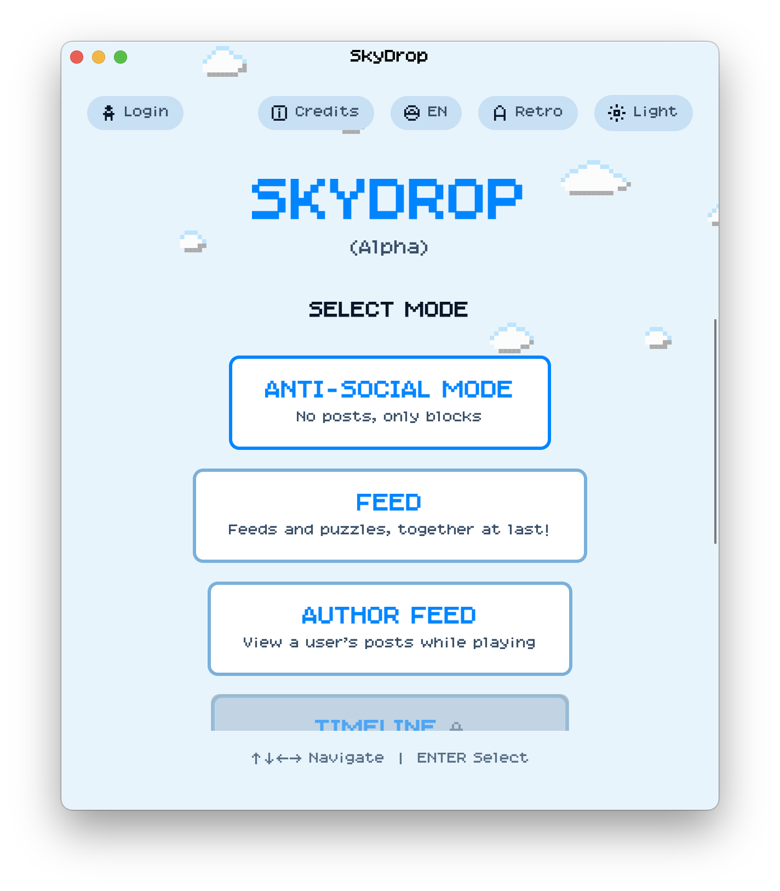

# SkyDrop

SkyDrop is a simple, Alpha, Bluesky "Client." You can read feeds and your timeline, as well as write posts. Unlike other clients, with SkyDrop you have to work for it by playing the game.

Read the [Gameplay](GAMEPLAY.md) docs for how it works. You can play the [Web version](https://drasticactions.github.io/SkyDrop/) here.

- Build with .NET and [Avalonia UI](https://avaloniaui.net).
- Uses [Nu Kinako Mochi](https://kokagem.sakura.ne.jp/font/mochi/) as the typeface

This is *Alpha Quality*, expect bugs!

## Why?

The idea came from a [tinybaby post](https://bsky.app/profile/did:plc:yhgc5rlqhoezrx6fbawajxlh/post/3mbjfemrthk2b), and my own frustration of building a [ATProtocol client library](https://github.com/drasticactions/FishyFlip) and not knowing what to build with it. Every time I tried to build a Bluesky client app, I would give up. Why bother building one when there are so many others out there. I would have nothing to add to it... Hence, SkyDrop.

## Native Versions:

I am working on building a signed release pipeline for the native client versions. The CI builds can be found as [artifacts](https://github.com/drasticactions/SkyDrop/actions/workflows/build-desktop.yml). The web and native app clients have the same features.

**NOTE:** These CI builds are not signed. If you are running this on macOS, you will need remove the quarantine by running:

`xattr -rd com.apple.quarantine /path/to/SkyDrop.app`

from the terminal. If you don't know how to do that, you should stick to the Web version for now.

## Build:

- Install the .NET 10 SDK
- For `SkyDrop.Browser`, install the `wasm-tools` workload
- `dotnet build src/SkyDrop.slnx`

## Known Issues:

- No sound or music. Have not made any yet.
- The default "Retro" font is [Nu Kinako Mochi](https://kokagem.sakura.ne.jp/font/mochi/). It does not support all Japanese characters, so I tried to get creative with my text and menu options. It can also be hard to read in general for English and Japanese, even though it looks really nice. You can revert to the system fonts on the title screen.
- The dakuten/handakuten can be cut off in the UI, this appears to be an Avalonia issue with CJK and this font.
- The "block droping gameplay" may not be _exactly_ the "best" version of said block dropping game you've played. I am tweaking it more and am open to suggestions, but this is not intended to have every possible feature for the best version of said block dropping game possible.
- The Login system uses password and not OAuth. Implmenting OAuth support in this context, especially for Web, is complex. As this is less intended as a "true" client experience and more of a bit of fun, I did not implement that yet. 
- Login info is not saved between sessions, you need to log in again when you restart the game. This was intentional for now, since doing that for Web would be tricky and I assume most people will play this once and never again (Or will not log in), but it's possible to do.
- Videos will not play. Thumbnails are shown.
- Holding inputs should work correctly for Desktop, but is limited to single presses on Web.
- The T9 list includes 10,000 english words. It's not complete, and I currently don't surface the word can't be found.
- Better documentation is needed for the games, or a tutorial for how to play would be nice.

Issues and PRs are welcome, but remember that this is a fun project. I will get to issues and PRs as I see fit and feel like it, so please don't be mad if I don't address it. If you want to play around with the codebase, you're welcome to fork this and do whatever you like. 